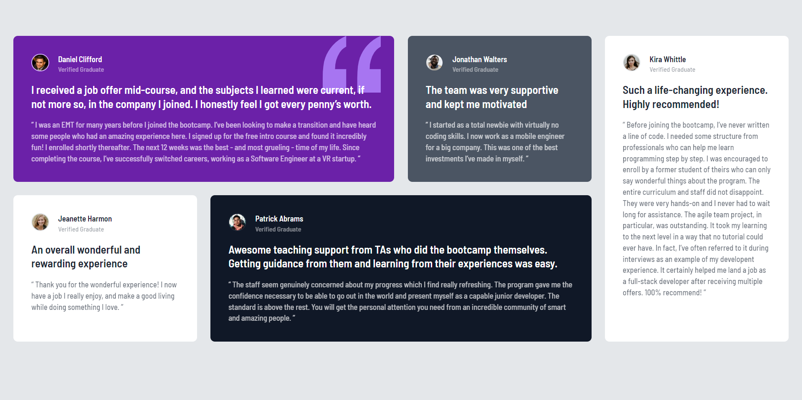

# Frontend Mentor - Testimonials grid section solution

This is a solution to the [Testimonials grid section challenge on Frontend Mentor](https://www.frontendmentor.io/challenges/testimonials-grid-section-Nnw6J7Un7). Frontend Mentor challenges help you improve your coding skills by building realistic projects.

## Table of contents

- [The challenge](#the-challenge)
- [Screenshot](#screenshot)
- [Links](#links)
- [Built with](#built-with)
- [What I learned](#what-i-learned)
- [Continued development](#continued-development)
- [Useful resources](#useful-resources)
- [Author](#author)

### The challenge

Users should be able to:

- View the optimal layout for the site depending on their device's screen size

### Screenshot

### Links

- Solution URL: [click here ](https://github.com/Psargar616/Frontend-Mentor---Testimonials-grid-section)
- Live Site URL: [click here](https://testimonial-grid-tailwind-fm-soln.netlify.app/)

### Built with

- Semantic HTML5 markup
- Tailwind CSS
- Flexbox
- CSS Grid
- Mobile-first workflow

### What I learned

I leared to make grid layout using Tailwind CSS.

### Continued development

This layout can be used in future projects and my portfolio website for adding testimonials.

### Useful resources

- [Tailwind docs](https://tailwindcss.com/docs/installation)

## Author

- Frontend Mentor - [@Psargar616](https://www.frontendmentor.io/profile/Psargar616)
- Twitter - [@PranjaliSargar](https://twitter.com/PranjaliSargar)
